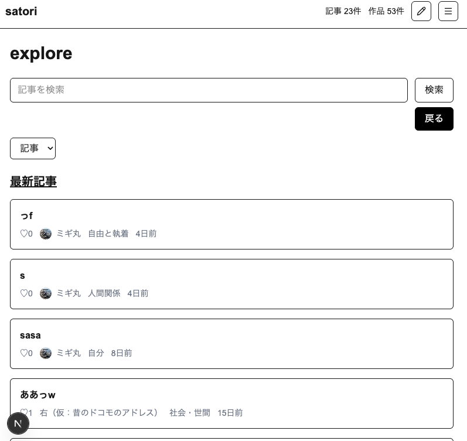

# satori

本番URL: https://satori-lyart.vercel.app

`satori` は、人生の中で生まれた「気づき」を記録・整理し、必要に応じて作品として残せる Web アプリです。  
自分の内面を記録するだけでなく、AI からフィードバックを受けたり、記事をもとに詩的な作品を生成したりできます。  
また、公開された記事や作品は他のユーザーも閲覧できます。

---

## アプリ概要

日々の中で生まれる「気づき」は、時間が経つと流れてしまいがちです。  
`satori` は、その気づきを記事として残し、あとから見返したり、AI を通して別の形で受け取ったりできるようにすることを目的にしています。

このアプリでは、ユーザーは次の2つの体験を行えます。

- **自分のための体験**
  - 気づきを記事として保存する
  - AI からフィードバックを受ける
  - 記事をもとに作品を生成する
- **他者と共有する体験**
  - 公開した記事や作品を他のユーザーに読んでもらう

---

## 主な機能

- ユーザー登録 / ログイン
- 記事CRUD
  - 作成
  - 編集
  - 保存
  - 一覧
  - 詳細
  - 削除
- 下書き機能
  - 下書き保存
  - 一覧
  - 編集
  - 削除
- AI作品生成機能
  - AI生成
  - 保存
  - 一覧
  - 詳細
  - 削除
  - レート制限
  - エラー保存
- AIフィードバック機能
  - AI生成
  - 保存（上書き）
  - 表示
  - 削除
  - レート制限
  - エラー保存
- 記事 / 作品の公開・非公開設定
- PDF出力
- 公開プロフィールページ
  - アイコン
  - 名前
  - 自己紹介
  - 公開記事一覧
  - 公開作品一覧
- 公開記事 / 公開作品一覧ページ（Explore）
- いいね機能 / いいね一覧
- 検索機能
- ジャンル別表示

---

## このアプリで大切にしたこと

### 1. 公開データと非公開データの分離
`satori` では、公開される記事・作品と、本人だけが扱うデータを明確に分けています。

特に **AIフィードバックは作成者本人しか閲覧できません。**  
これは「公開して見せる文章」と「自分だけが受け取る内省支援」を分けるための重要な設計です。

### 2. AI生成結果を状態管理すること
AI機能は「成功したら終わり」ではなく、以下の状態を持つようにしています。

- `PENDING`
- `SUCCESS`
- `ERROR`

これにより、生成中・成功・失敗を UI 上で分かりやすく扱えるようにしています。

### 3. 将来拡張しやすい責務分離
AI機能は以下の責務に分けて実装しています。

- snapshot 作成
- prompt 作成
- LLM 呼び出し
- schema / 型検証
- DB 保存

これにより、プロンプトの変更やモデルの差し替え、保存項目の追加がしやすい構成にしています。

---

## 技術スタック

- Next.js（App Router）
- React
- TypeScript
- Tailwind CSS
- Supabase Auth
- Supabase Postgres
- Supabase Storage
- Prisma
- OpenAI API（Responses API）
- react-pdf
- Vercel

---

## アーキテクチャの考え方

### DB = ユーザーが生む動的データの正
`satori` では、ユーザーが生み出すデータを DB の正としています。

主な対象:
- `User`
- `Work`
- `Feedback`
- `GeneratedContent`
- `WorkLike`
- `GeneratedContentLike`
- `AiRateLimitEvent`

### AI機能の流れ
AIレビュー / AI作品生成は、以下の流れで処理しています。

- snapshot 作成
- prompt 作成
- LLM 呼び出し
- JSON schema / 型検証
- DB 保存
- UI で `PENDING / SUCCESS / ERROR` を表示

---

## 主な関係
User 1 : N Work
Work 1 : 1 Feedback
Work 1 : N GeneratedContent
User N : N Work（WorkLike 経由）
User N : N GeneratedContent（GeneratedContentLike 経由）

## 工夫した点
### RLS と公開 / 非公開制御
他人の非公開データが返らないことを重視して、RLS を先に整備しました。
公開記事 / 公開作品だけが Explore や公開プロフィールに出るようにしています。

### AI機能の責務分離
prompts
snapshots
schemas
persistence
generate-*

に分け、AI実装を1ファイルに閉じ込めないようにしました。

### AI結果の状態管理
SUCCESS / ERROR / PENDING を DB に保存
成功は初回のみ通知
失敗は詳細ページで確認可能
レート制限エラーも UI 表示

### Prisma / Supabase / Vercel の運用整理
ローカルと本番で migration の流し方を分離
Prisma Client generate のタイミングを運用メモ化
Vercel ビルド時に Prisma generate を明示

## PDF出力
記事本文 / 作品を PDF 化
react-pdf で日本語フォント対応


## 想定ユーザー

- 人生の中で得た気づきを言葉として残したい人
- 自分の考えを整理したい人
- AI に話を聞いてもらうようにフィードバックを受けたい人
- 自分の文章を作品として残したい人
- 他人の気づきや作品を読んでみたい人

---


## セットアップ

### 必要な環境変数

#### Supabase / DB
- `NEXT_PUBLIC_SUPABASE_URL`
- `NEXT_PUBLIC_SUPABASE_ANON_KEY`
- `SUPABASE_SERVICE_ROLE_KEY`
- `DATABASE_URL`

#### OpenAI
- `OPENAI_API_KEY`
- `OPENAI_MODEL_TEXT`
- `OPENAI_MODEL_JSON`

---

## 起動方法

```bash
npm install
npx prisma generate
npm run dev

## マイグレーション
- ローカル
npx dotenv-cli -e .env.local -- npx prisma migrate dev --name <migration_name>

- 本番
npx dotenv-cli -e .env.prod -- npx prisma migrate deploy

## デプロイ
Vercel の Build Command は以下を使用しています（ギットプッシュするたびに自動で以下のコマンドが実行されます）。
npx prisma generate --schema=./prisma/schema.prisma && next build


## Screenshot



## 今後の改善案
- AI生成の非同期ジョブ化
- 現在は同期実行が中心のため、将来的にはキューやバックグラウンド処理を導入したい
- AI生成結果の再試行導線の改善
- 作品生成スタイルの追加
- 詩以外の表現形式も増やせる設計にしたい
- おすすめ表示 / レコメンドの追加
- 通知や履歴の強化
- テスト整備 特に AI生成・保存・状態管理まわり
- 「パスワードを忘れた方はこちら」のボタンの実装
- Googleでログインできるようにする
- 利用規約・プライバシーポリシーへのリンクを作成


詳細はこちら

## Docs

[運用メモ](./docs/ops.md)  
[学習メモ](./docs/knowledge-base.md)  
[失敗ログ / Troubleshooting](./docs/troubleshooting.md)
[企画書](./docs/proposal.md)
[実装予定](./docs/data-model.md)
